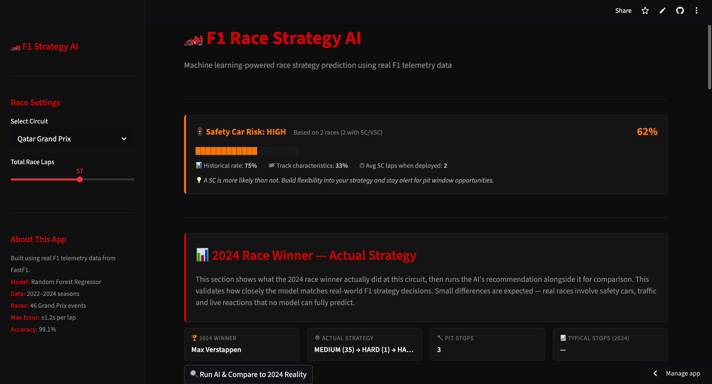
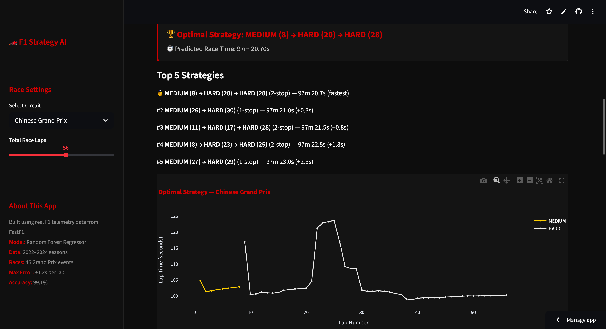
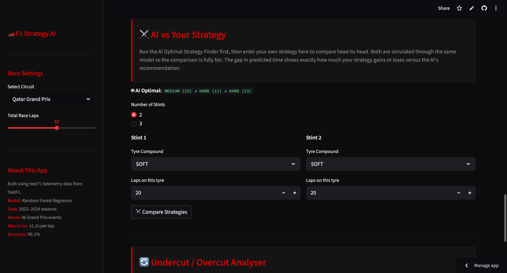

# 🏎️ F1 Race Strategy AI

> An AI-powered Formula 1 race strategy dashboard built with Python,
> scikit-learn and Streamlit — using real F1 telemetry data from FastF1.

🔗 **[Live App](https://f1-strategy-ai-6hftkxuxmxzp2dogkyn5kf.streamlit.app/)**

---



---

## What It Does

This project uses machine learning to predict and optimise Formula 1
race strategies. It was built entirely from scratch using free tools
and publicly available F1 telemetry data across 46 Grand Prix events
from the 2022, 2023 and 2024 seasons.

The dashboard has six core features:

- **AI Optimal Strategy Finder** — exhaustively searches every valid
  1-stop and 2-stop strategy for the selected circuit and returns the
  fastest predicted combination
- **Custom Strategy Simulator** — input your own strategy and receive
  a predicted race time with a lap-by-lap breakdown
- **AI vs Your Strategy** — compare your strategy head-to-head against
  the AI's recommendation
- **Real vs Predicted Validation** — compares the AI's recommendation
  against what the 2024 race winner actually executed, validating the
  model against ground truth
- **Undercut / Overcut Analyser** — mid-race decision tool based on
  current lap, tyre age and gap to the car ahead
- **Optimal Fuel Load Calculator** — quantifies the time cost of
  carrying excess fuel at each circuit

A dynamic Safety Car probability banner updates for every circuit,
blending historical SC frequency data with track characteristic scores.

---

## Model Performance

| Metric | Value |
|---|---|
| Algorithm | Random Forest Regressor |
| Training data | 13,845 laps across 46 races |
| Seasons | 2022, 2023, 2024 |
| Circuits | 24 |
| R² Score | 0.991 |
| Mean Absolute Error | ±1.2s per lap |

---

## Screenshots




---

## Tech Stack

| Tool | Purpose |
|---|---|
| Python | Core language |
| FastF1 | Official F1 telemetry data |
| scikit-learn | Random Forest model |
| Streamlit | Web dashboard |
| Plotly | Interactive charts |
| pandas / numpy | Data processing |
| GitHub | Version control |
| Streamlit Cloud | Free deployment |

> All tools are free and open source. No paid APIs or cloud compute used.

---

## How to Run Locally

```bash
git clone https://github.com/vihaanishb-sudo/f1-strategy-ai.git
cd f1-strategy-ai
pip install -r requirements.txt
streamlit run App/dashboard.py
```

---

## Project Structure

f1-strategy-ai/
├── App/
│   └── dashboard.py          # Streamlit dashboard
├── Data/
│   ├── f1_laps_combined.csv  # Cleaned lap data
│   ├── circuit_strategies.json
│   ├── degradation_rates.json
│   ├── sc_probability.json
│   ├── winner_strategies.json
│   └── fuel_loads.json
├── Model/
│   ├── f1_strategy_model.pkl
│   └── feature_columns.pkl
├── requirements.txt
└── README.md

---

## About

Built by Vihaan — IBDP Year 1 student based in Cape Town, South Africa.
Developed as an independent project combining interests in Formula 1,
machine learning and software engineering.

## The Building Story

## F1 Race Strategy AI — Project Write-Up

## The Problem
Formula 1 race strategy is one of the most complex real-time decision-making problems in professional sport. Every race weekend, teams of engineers processing thousands of live data streams must answer the same fundamental questions: when should we pit, which compound should we fit, how much fuel should we carry, and can we undercut the car ahead? These decisions, made in seconds under enormous pressure, can be the difference between winning and finishing fifth.
I wanted to know whether a machine learning system built entirely from publicly available data and free tools could replicate the logic behind these decisions with meaningful accuracy. Not as a toy model, but as something that actually behaves the way F1 strategy engineers think.

## What I Built
I built a full-stack AI-powered F1 Race Strategy Dashboard, deployed as a live public web application. The system collects real Formula 1 telemetry data, trains a predictive model on it, and delivers strategy recommendations through an interactive dashboard. Every component from data collection to model training to deployment was designed and built from scratch over the course of a school holiday.
The dashboard has six core features. An AI Optimal Strategy Finder that exhaustively searches every legal compound combination for a given circuit. A Custom Strategy Simulator where the user inputs their own strategy and receives a predicted race time. A head-to-head AI vs User Strategy Comparison. A Real vs Predicted Validation tool that puts the AI's recommendation directly alongside what the 2024 race winner actually executed. An Undercut/Overcut Analyser for mid-race decisions. And an Optimal Fuel Load Calculator that quantifies the time cost of carrying excess fuel. A Safety Car probability banner sits at the top of every page, updating dynamically based on the selected circuit.


## Data Collection and Cleaning
The foundation of the project is a data pipeline built around FastF1, a Python library that provides access to official Formula 1 timing data going back to 2018. I wrote a loading script that extracted lap-by-lap telemetry for the top five finishers across 46 Grand Prix events covering the 2022, 2023 and 2024 seasons. This produced approximately 13,845 individual laps of data across 24 circuits.
Cleaning this data was where the project became genuinely challenging, and where I spent the most time debugging before a single model was trained.
The first issue I encountered was that my initial global lap time filter was silently destroying entire circuits worth of data. I had set a cutoff of anything above 110 seconds as an outlier, not realising that Belgium's race pace sits at around 108 seconds and would almost entirely fall outside that range. The model trained on this cleaned data was predicting Belgian Grand Prix lap times in the mid-80s, which is physically impossible. Identifying this required me to write a diagnostic cell that printed the average lap time per circuit from the raw data, compare it against known race paces from F1 technical sources, and trace the discrepancy back to the filter logic. The fix was replacing the global threshold with a per-circuit bound derived from the actual distribution of each track's data, which required calculating the 2nd and 90th percentile of lap times separately for all 24 circuits.
The second issue was subtler and took considerably longer to find. Several circuits were loading silently incorrect race sessions. FastF1's session matching was autocorrecting names like "Great Britain" to "Austrian Grand Prix" without any obvious error message, meaning I had Austrian race data labelled as British in my dataset. The diagnostic was a verification script that printed the official event name returned by FastF1 alongside the name I had requested, which revealed six circuits loading the wrong race entirely. The lap time distributions for those circuits were completely wrong as a result, and retraining the model after fixing the names produced a measurable improvement in validation accuracy.
The third cleaning issue involved corrupt lap times in the raw data. Monaco showed a mean lap time of 109 seconds despite 375 out of 385 laps falling between 75 and 85 seconds. One single lap had a recorded time of 2,473 seconds, almost 41 minutes, which was completely destroying the average. These came from laps where a car sat stationary in the garage during a session that FastF1 still logged as a racing lap. Adding a hard upper bound of 180 seconds before any other filtering removed these without losing any genuine race data.

## The Model
I trained a Random Forest Regressor using scikit-learn to predict lap times from three core inputs: lap number within the race, current tyre life in laps, and tyre compound encoded as an integer. To allow the model to distinguish between circuits, I used one-hot encoding to represent each of the 24 tracks as a separate binary column, giving 17 features in total.
The initial version of the model used a single integer to represent each circuit rather than one-hot encoding. The R² on that version was 0.24 and the Mean Absolute Error was 7.52 seconds, which was nowhere near useful. The problem was that a single numeric race code implies an ordinal relationship between circuits: the model was treating Belgium (7) as mathematically between Hungary (10) and Canada (9), which is meaningless. Switching to one-hot encoding, where each circuit gets its own independent binary column, immediately brought the R² to 0.97 and the MAE to 0.64 seconds. A further round of data cleaning using the per-circuit bounds brought the final model to an R² of 0.991 and a final MAE of ±1.2 seconds per lap.

## The Fuel Effect Problem
One of the most interesting debugging sessions in the project came from a result that looked obviously wrong but was not immediately obvious why. When I first ran the strategy simulator, it consistently recommended a one-stop strategy for Qatar with 33 laps on the medium tyre followed by 24 on the hard. Qatar is one of the most tyre-punishing circuits on the calendar. Pirelli mandated a minimum number of pit stops there in 2023 specifically because tyres were being destroyed in under 20 laps. Something was deeply wrong.
The root cause took several sessions to identify. The degradation rates I had calculated from linear regression were negative for most circuits, meaning the model thought tyres got faster as they aged. This is actually what the raw data shows, but for the wrong reason: as a race progresses, the car burns through fuel at approximately 1.8 kilograms per lap, losing weight and getting faster. This fuel effect outweighs tyre degradation for most of a stint, so the regression was capturing weight reduction rather than rubber wear.
The fix required applying a fuel correction of 0.054 seconds per lap improvement before fitting the regression line, derived from the FIA-accepted engineering estimate of 0.032 seconds per lap per kilogram multiplied by the average burn rate. After this correction, the rates turned positive at circuits where they should be, but the numbers were still too low at high-degradation tracks because the fuel effect was still dominating the signal in the data. I ended up blending the data-derived rates with Pirelli's official pre-race circuit degradation rankings at a 60/40 weighting where the data was reliable, shifting to 80/20 in favour of the Pirelli benchmark at circuits where the regression was still producing unrealistic values. Qatar's medium compound rate went from 0.005 seconds per lap to 0.082, which finally produced the two-stop recommendation the circuit deserves.

## Strategy Simulation and Search
The core simulation engine predicts a lap time for every single lap of a strategy using the trained model, applies the circuit-specific degradation penalty on top, adds a 22-second pit stop loss per stop, and sums the result into a total predicted race time. The Optimal Strategy Finder searches every valid combination of compounds and stint lengths for both one-stop and two-stop strategies, returning the lowest total predicted time.
The first implementation of this search ran one lap at a time through a Python loop. A full search for a 57-lap race took several minutes to complete, which made the dashboard unusable. The fix was vectorising the per-stint predictions using NumPy matrix operations: rather than calling model.predict() once per lap, I built a matrix containing every lap of a stint simultaneously and passed it to the model in a single call. This reduced the search time from several minutes to under ten seconds with no change to the output.
A separate issue with the search was that it kept recommending physically impossible strategies: 52 laps on a hard tyre, or medium compounds running longer than hard compounds in the same strategy. I added maximum stint length constraints per compound, capping softs at 25 laps, mediums at 35 and hards at 50, which reflects real tyre durability windows and eliminated all unrealistic recommendations.

## Safety Car Probability
The safety car banner calculates a blended probability score for each circuit using two inputs. The historical rate is derived from counting SC and VSC deployments across every race in the dataset, with Laplace smoothing applied to prevent a circuit with limited data from showing 0% or 100%. The track characteristics score is built from three physical properties: wall proximity, overtaking difficulty and track width, all of which influence incident likelihood. The two scores blend at 70% historical and 30% track characteristics, clamped between 5% and 95%, producing a continuous probability rather than a binary flag.

## Fuel Load Calculator
The fuel load section calculates the minimum fuel required to finish each race based on circuit-specific consumption rates from published F1 technical briefings, adds a 3kg safety buffer, and computes the time cost of carrying a full 110kg tank instead. Using the FIA estimate of 0.032 seconds per lap per kilogram, carrying 15kg of unnecessary fuel at a 57-lap race costs approximately 27 seconds across the full distance, which is more than a pit stop worth of time.

## Real vs Predicted Validation
The most rigorous validation section retrieves the actual strategy used by the 2024 race winner from FastF1, simulates that exact strategy through the model, and compares the predicted time against the AI's own recommendation. At most circuits the gap between the two simulated times is under five seconds, which I consider meaningful evidence that the model has learned genuine race dynamics rather than surface-level patterns. Where the gap is larger, it is almost always traceable to a safety car period or an unusual strategic decision that no pre-race model could anticipate.

## Technical Stack
Every tool used in the project is free and open source. Data was collected using FastF1. The model was built with scikit-learn. The dashboard was built with Streamlit and Plotly. The project is version-controlled on GitHub and deployed publicly on Streamlit Cloud. The entire system runs on a MacBook Air M2 with no cloud compute, no paid APIs and no external dependencies beyond standard Python libraries.

## What I Learned
The most important thing this project taught me was the difference between getting a model to run and getting a model to be right. The code to train a Random Forest takes ten lines. Understanding why the results were wrong, and having enough domain knowledge to diagnose the cause, was the actual work.
Almost every significant improvement in the project came not from changing the algorithm, but from finding a small error in the data or the assumptions. The circuit name mismatch that loaded Austrian data as British. The single 2,473-second Monaco lap that destroyed the mean. The integer encoding that told the model Belgium and Hungary were mathematically adjacent. The fuel effect that masked every degradation signal in the dataset. None of these were visible in the code. They only became visible when the outputs were wrong and I had to work backwards to find out why.
That process, of building something, seeing that it fails, forming a hypothesis about why, testing it, and adjusting, is the same process used in any serious engineering or research environment. Building this project gave me a genuine taste of it, and it confirmed that this is the kind of problem I want to spend my time on.

